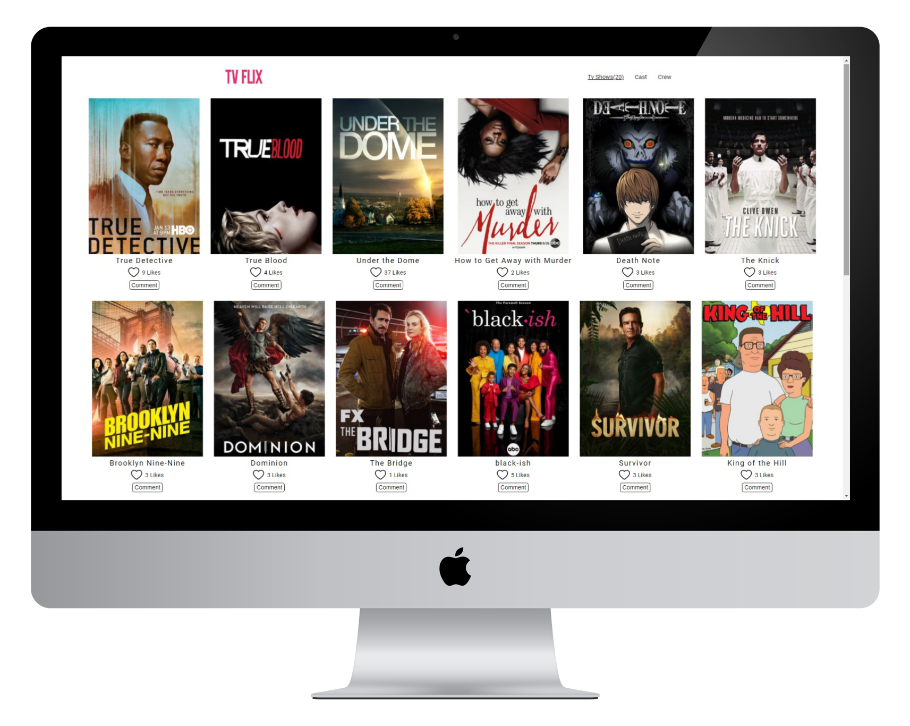

# TV-Flix

> Created with my coding partner from Kenya. We used an Api containing TV shows and fetched it into an arr and used that array to display shows dynamically to the UI.



## Built With

- HTML
- CSS
- JavaScript
- Webpack
- Jest

## Live Demo

[Live Demo Link](https://mrsamsharma.github.io/Tv-Show/)

## Presentation
[Link to the presentation video](https://drive.google.com/file/d/1_e5uBI6biwFd0IPSj4OO-cdlH74WdKYW/view?usp=sharing)

## To make a copy

Run:
```
git clone git@github.com:mrsamsharma/Tv-Show.git
```

## Authors

👤 **Satyam Sharma**

- GitHub: [@samWfelcie](https://github.com/samWfelice)
- Twitter: [@samwfelice](https://twitter.com/samwfelice)
- LinkedIn: [samfelice](https://www.linkedin.com/in/samfelice)


👤 **Alphayo Wakarindi**

- GitHub: [@alphayowakarindi](https://github.com/alphayowakarindi)
- LinkedIn: [alphayo-wakarindi-15a825236](https://www.linkedin.com/in/alphayo-wakarindi-15a825236/)


## 🤝 Contributing

Contributions, issues, and feature requests are welcome!

Feel free to check the [issues page](../../issues/).

## Show your support

Give a ⭐️ if you like this project!

## 📝 License

This project is [MIT](./MIT.md) licensed.
